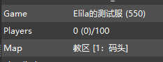

# A2S_INFO 信息修改
#### 自定义服务器 A2S INFO 的输出内容 (游戏描述, 地图名称)
---
* 效果图
   
* 所需平台
    * Sourcemod 1.11+
* 依赖组件
    * [SourceScramble](https://github.com/nosoop/SMExt-SourceScramble/releases)
    * [left4dhooks](https://forums.alliedmods.net/showthread.php?t=321696)
    * [l4d2_source_keyvalues](https://github.com/fdxx/l4d2_source_keyvalues)
    * [localizer](https://github.com/dragokas/SM-Localizer)
---
* 插件指令
    * a2s_info_mapname_type - **地图名称显示的类型 (默认4, 为显示任务+章节+救援进度)**
        * 

显示类型

            * 以官方图 C1M4 为例
                * 1 - 只显示任务名.
                    * 死亡中心
                * 2 - 显示任务+章节.
                    * 死亡中心 [4: 中厅]
                * 3 - 显示任务+救援进度 (非终局下为 类型1 显示).
                    * 死亡中心 - 救援进行中 / 死亡中心 - 救援未进行
                * 4 - 显示任务+章节+救援进度 (非终局下为 类型2 显示)
                    * 死亡中心 [4: 中厅] - 救援进行中 / 死亡中心 [4: 中厅] - 救援未进行
                * 5 - 显示任务+[当前章节/最大章节]
                    * 死亡中心 [4/4]

        

    * a2s_info_mapname_language - **官方地图的翻译文本使用何种官方本地化语言 (默认chi, 为简体中文)**
        * 修改过此参数必须前往 **addons/sourcemod/translations** 下 **删除** 以下两个文件后重启服务器来生成翻译文件
            * a2s_chapters.phrases.txt
            * a2s_missions.phrases.txt
---
* 插件命令
    * a2s_edit_reload -- **重新加载插件文本配置文件, 需要ROOT管理员权限**
---
* 插件配置文件
    * 在 **data** 目录下的 **a2s_info_edit.cfg** .
        * description - **游戏描述**
        * inFinale - **进入救援流程时的文本**
        * notInFinale - **未进入救援流程时的文本**
    * 修改好后请 **a2s_edit_reload** 重新加载配置文件
---
* 感谢
    * [lakwsh](https://github.com/lakwsh) - 给予签名和偏移的帮助
    * [fdxx](https://github.com/fdxx) - 此插件的部分代码来源
    * [umlka](https://github.com/umlka) - 此插件的部分代码来源
---
* 注意事项
    * 此插件不支持监听和本地服务器!!
